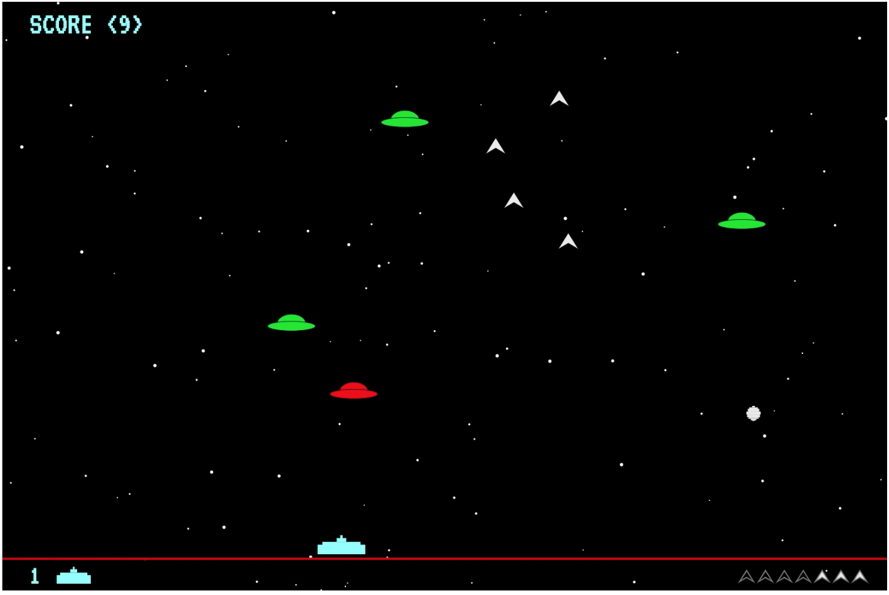

# spaceinvaders

A [Space Invaders](https://en.wikipedia.org/wiki/Space_Invaders) inspired retro shooter game in Clojure using [Quil](http://quil.info/).

  

## Usage

Run `lein figwheel` in your terminal. Wait for a while until you see `Successfully compiled "resources/public/js/main.js"`. Open [localhost:3449](http://localhost:3449) in your browser.

## Play Guide

The object of the game is to shoot UFOs descending from the sky with your tank. Press SPACE to release the missiles.  Each UFO you destroy is worth 1 point. If an UFO escapes the canvas you lose 1 point. The UFOs randomly fire bombs down the screen from their centre, and you lose 1 life if a bomb hits your tank. You also lose a life if the tank collides with an UFO. You win the game if you manage to collect 100 points. 

Move the tank to the left (LEFT ARROW) or right (RIGHT ARROW), or speed up (UP ARROW) and down (DOWN ARROW).
Turn the sound on/off (press S). There is no time limit.

Good luck!

## License

Copyright © 2020 Louise Klodt

Distributed under the Eclipse Public License either version 1.0 or (at
your option) any later version.
